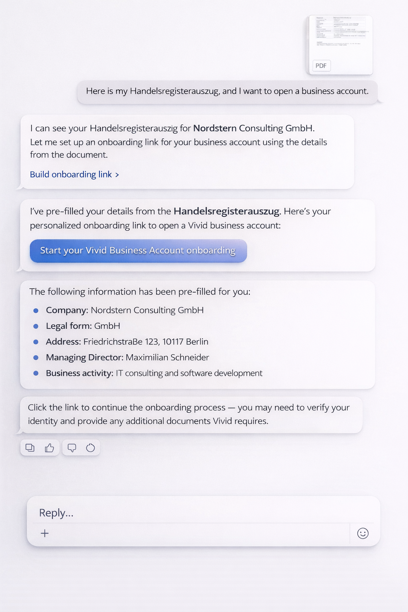

<div align="center">

# Vivid MCP

<a href="https://vivid.money" target="_blank" style="border-radius: 5px">
  


</a>


### Open a business account right from your AI chat

Tell your AI to open a Vivid Business account.<br>
Share your company details, and your account is ready — no tab switching required.

<br>

[](https://claude.ai)
[](https://chatgpt.com)
[](https://cursor.com)
[](https://modelcontextprotocol.io)

<br>

[**How it works**](#how-it-works) &nbsp;&middot;&nbsp; [**Get Started**](#get-started) &nbsp;&middot;&nbsp; [**Features**](#features) &nbsp;&middot;&nbsp; [**Skills**](#skills)

</div>

<br>

---

## How it works

<table>
<tr>
<td width="33%" align="center">

**1. Share your company info**

Upload registration documents or describe your business in chat

</td>
<td width="33%" align="center">

**2. AI handles the rest**

Details are extracted and your account is created automatically

</td>
<td width="33%" align="center">

**3. Account ready**

Everything is pre-filled. Verify your identity and start banking

</td>
</tr>
</table>

<br>

```
┌─────────────────────────────────────────────────────────────────────────────┐
│  AI Chat                                                                    │
├─────────────────────────────────────────────────────────────────────────────┤
│                                                                             │
│  You: 📎 Handelsregisterauszug_GmbH.pdf                                     │
│       I want to open a business account                                     │
│                                                                             │
│  AI:  I've read your document — Nordstern Consulting GmbH, Berlin.          │
│       Setting up your Vivid Business account with pre-filled details...     │
│                                                                             │
│       ✓ Your account is ready. Complete verification to start banking.     │
│                                                                             │
└─────────────────────────────────────────────────────────────────────────────┘
```

<div align="center">
<kbd></kbd>


</div>

<br>

---

## 🚀 Get Started

> **MCP Server** &nbsp;&nbsp;`https://api.prime.vivid.money/mcp`
>
> No API key required. Works with any MCP-compatible client.

<br>

<details>
<summary><strong>Claude</strong></summary>

<br>

1. Go to [claude.ai/settings/connectors](https://claude.ai/settings/connectors)
2. Click **Add custom connector**
3. Paste:

```
https://api.prime.vivid.money/mcp
```

<br>
</details>

<details>
<summary><strong>ChatGPT</strong></summary>

<br>

1. Open **Settings → Apps → Advanced**
2. Click **Create App**
3. Paste:

```
https://api.prime.vivid.money/mcp
```

<br>
</details>

<details>
<summary><strong>Cursor</strong></summary>

<br>

[](https://cursor.com/en-US/install-mcp?name=vivid-mcp&config=eyJ1cmwiOiJodHRwczovL2FwaS5wcmltZS52aXZpZC5tb25leS9tY3AifQ%3D%3D)

<br>
</details>

<details>
<summary><strong>Any MCP Client</strong></summary>

<br>

Add a remote HTTP MCP server with URL:
```
https://api.prime.vivid.money/mcp
```

| Protocol | Transport | Authentication |
|:---------|:----------|:---------------|
| Model Context Protocol | HTTPS (streamable) | Not required |

<br>
</details>

<br>

---

## Features

| Feature | Status |
|:--------|:------:|
| **Open a business account** | ✅ `Live` |
| Account balances | `Soon` |
| Transaction history | `Soon` |
| Card management | `Soon` |
| Spending insights | `Soon` |

<br>

---

## 🧩 Skills

This repository includes ready-to-use skills compatible with **Claude Code**, **OpenClaw**, and [**AgentSkills**](https://agentskills.io) standard.

```
skills/
└── business-account-opening/
    └── SKILL.md
```

> **Claude Code (marketplace)**
> ```
> /plugin marketplace add vivid-money/vivid-mcp
> /plugin install vivid-mcp@vivid-mcp
> ```
>
> **Claude Code (local)** — `claude --plugin-dir ./vivid-mcp`
>
> **OpenClaw** — `cp -r skills/business-account-opening ~/.openclaw/skills/`

<br>

---

<div align="center">

<br>

<a href="https://vivid.money" target="_blank">
    <kbd>
  
</kbd>
</a>

<br>

</div>
